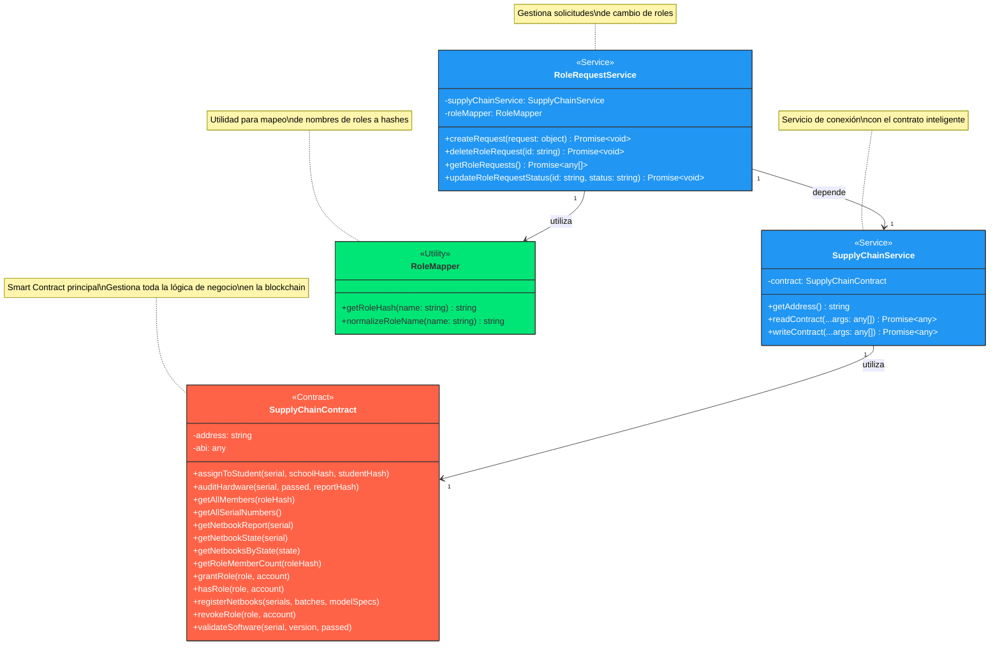
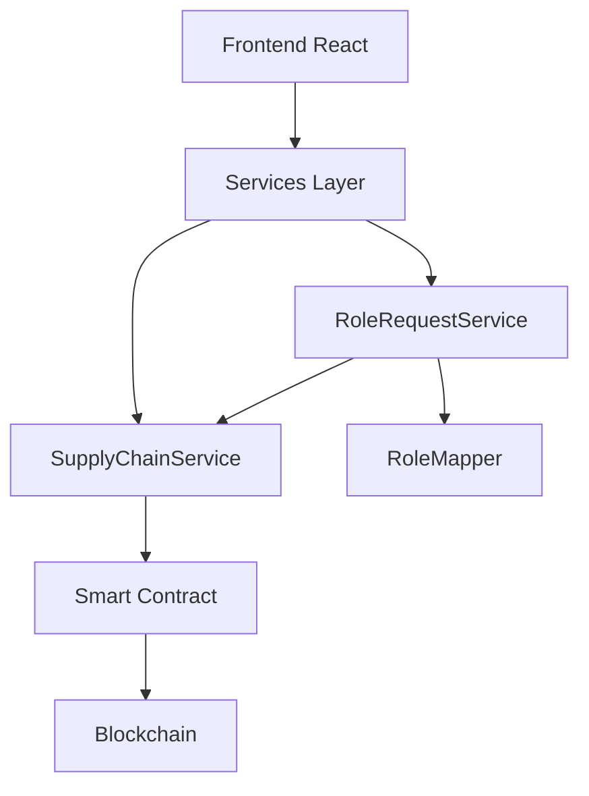
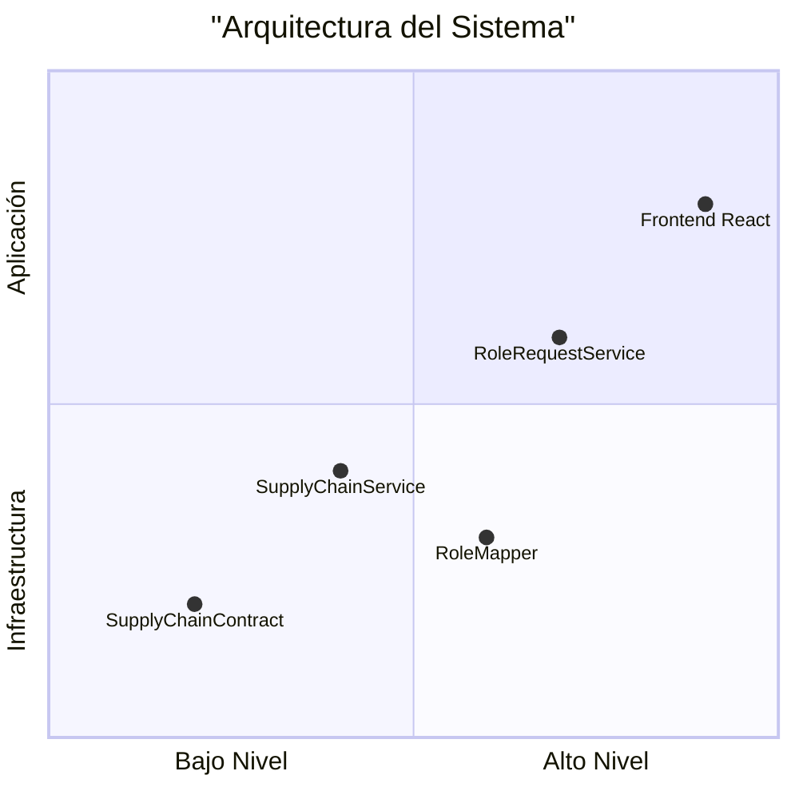

El proyecto en cuestión es una aplicación web desarrollada en TypeScript y React que se enfoca en la gestión de dispositivos netbooks en una cadena de suministro. La aplicación incluye varias funcionalidades para administrar los dispositivos, como la asignación de dispositivos a estudiantes, la auditoría de hardware y software, y la gestión de solicitudes de roles.

## La aplicación web se divide en varias pantallas principales:

1. Pantalla de inicio: La pantalla de inicio muestra una breve descripción del sistema y una lista de las funcionalidades disponibles.
2. Pantalla de inicio de sesión: La pantalla de inicio de sesión permite a los usuarios iniciar sesión en la aplicación.
3. Pantalla de registro: La pantalla de registro permite a los usuarios registrarse en la aplicación.
4. Pantalla de perfil: La pantalla de perfil muestra la información del usuario actual, incluyendo su nombre, correo electrónico, rol y dirección.
5. Pantalla de asignación de dispositivos: La pantalla de asignación de dispositivos permite a los usuarios asignar dispositivos netbooks a estudiantes.
6. Pantalla de auditoría de hardware: La pantalla de auditoría de hardware permite a los usuarios auditar el hardware de los dispositivos netbooks y registrar los resultados de la auditoría.
7. Pantalla de auditoría de software: La pantalla de auditoría de software permite a los usuarios auditar el software de los dispositivos netbooks y registrar los resultados de la auditoría.
8. Pantalla de gestión de solicitudes de roles: La pantalla de gestión de solicitudes de roles permite a los usuarios crear, eliminar y actualizar solicitudes de roles.
9. Pantalla de registro de dispositivos: La pantalla de registro de dispositivos permite a los usuarios registrar nuevos dispositivos netbooks en la cadena de suministro.
10. Pantalla de gestión de usuarios: La pantalla de gestión de usuarios permite a los usuarios gestionar los usuarios de la aplicación, incluyendo la creación, eliminación y actualización de usuarios.
11. Pantalla de registro de auditorías: La pantalla de registro de auditorías permite a los usuarios registrar auditorías de los eventos importantes en el sistema.
12. Pantalla de diagnóstico de servicios: La pantalla de diagnóstico de servicios permite a los usuarios diagnosticar problemas de inicialización de servicios y registrar auditorías.

## Las pantallas se agrupan en las siguientes categorías:

1. Pantallas de gestión de dispositivos: Pantalla de asignación de dispositivos, pantalla de auditoría de hardware, pantalla de auditoría de software y pantalla de registro de dispositivos.
2. Pantallas de gestión de roles: Pantalla de gestión de solicitudes de roles y pantalla de gestión de usuarios.
3. Pantallas de registro: Pantalla de inicio de sesión, pantalla de registro y pantalla de registro de auditorías.
4. Pantallas de diagnóstico: Pantalla de diagnóstico de servicios.

## Diagrama de Arquitectura Detallado

## Flujo de Datos

## Capas de la Aplicación

  