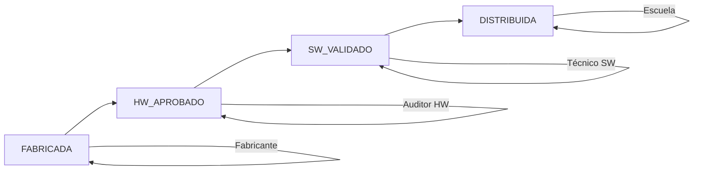

# DIAGRAMA UML - SUPPLYCHAINTRACKER

## ESTRUCTURA GENERAL DEL CONTRATO

```mermaid
graph TD
    A[SupplyChainTracker] --> B[AccessControlEnumerable]
    A --> C[Roles]
    A --> D[Enums]
    A --> E[Estructuras de Datos]
    A --> F[Almacenamiento]
    A --> G[Eventos]
    A --> H[Funciones ERC-20]
    A --> I[Funciones de Escritura]
    A --> J[Funciones de Lectura]

    C --> C1[FABRICANTE_ROLE]
    C --> C2[AUDITOR_HW_ROLE]
    C --> C3[TECNICO_SW_ROLE]
    C --> C4[ESCUELA_ROLE]
    C --> C5[DEFAULT_ADMIN_ROLE]

    D --> D1[State]
    D1 --> D1A[FABRICADA]
    D1 --> D1B[HW_APROBADO]
    D1 --> D1C[SW_VALIDADO]
    D1 --> D1D[DISTRIBUIDA]

    E --> E1[Netbook]
    E1 --> E1A[Datos de Origen]
    E1 --> E1B[Datos de Hardware]
    E1 --> E1C[Datos de Software]
    E1 --> E1D[Datos de Destino]
    E1 --> E1E[Estado actual]

    F --> F1[netbooks mapping]
    F --> F2[allSerialNumbers array]

    G --> G1[NetbookRegistered]
    G --> G2[HardwareAudited]
    G --> G3[SoftwareValidated]
    G --> G4[NetbookAssigned]

    H --> H1[name]
    H --> H2[symbol]
    H --> H3[decimals]
    H --> H4[totalSupply]
    H --> H5[balanceOf]
    H --> H6[transfer]
    H --> H7[approve]
    H --> H8[allowance]
    H --> H9[transferFrom]

    I --> I1[registerNetbooks]
    I --> I2[auditHardware]
    I --> I3[validateSoftware]
    I --> I4[assignToStudent]
    I --> I5[grantRole]
    I --> I6[revokeRole]

    J --> J1[getNetbookState]
    J --> J2[getNetbookReport]
    J --> J3[getAllSerialNumbers]
    J --> J4[getAllMembers]
    J --> J5[totalNetbooks]
    J --> J6[getNetbooksByState]
    J --> J7[hasRole]
    J --> J8[getRoleMemberCount]
    J --> J9[getRoleMember]
```



## DETALLES DE LA ESTRUCTURA

### 1. HERENCIA

El contrato `SupplyChainTracker` hereda de `AccessControlEnumerable` de OpenZeppelin, lo que le proporciona:

- Sistema de control de acceso basado en roles
- Enumeración de miembros por rol
- Funciones de gestión de roles (grantRole, revokeRole, etc.)

### 2. ROLES DEFINIDOS

```solidity
bytes32 public constant FABRICANTE_ROLE = keccak256("FABRICANTE_ROLE");
bytes32 public constant AUDITOR_HW_ROLE = keccak256("AUDITOR_HW_ROLE");
bytes32 public constant TECNICO_SW_ROLE = keccak256("TECNICO_SW_ROLE");
bytes32 public constant ESCUELA_ROLE = keccak256("ESCUELA_ROLE");
```

### 3. ENUMERACIÓN DE ESTADOS

```solidity
enum State {
    FABRICADA,      // 0 - Estado inicial
    HW_APROBADO,    // 1 - Hardware auditado y aprobado
    SW_VALIDADO,    // 2 - Software instalado y validado
    DISTRIBUIDA     // 3 - Asignada a estudiante
}
```

### 4. ESTRUCTURA DE DATOS - NETBOOK

```solidity
struct Netbook {
    // A. Datos de Origen
    string serialNumber;
    string batchId;
    string initialModelSpecs;

    // B. Datos de Hardware
    address hwAuditor;
    bool hwIntegrityPassed;
    bytes32 hwReportHash;

    // C. Datos de Software
    address swTechnician;
    string osVersion;
    bool swValidationPassed;

    // D. Datos de Destino
    bytes32 destinationSchoolHash;
    bytes32 studentIdHash;
    uint256 distributionTimestamp;

    // Estado actual
    State currentState;
    bool exists;
}
```

### 5. ALMACENAMIENTO

```solidity
// Mapeo de netbooks por número de serie
mapping(string => Netbook) private netbooks;

// Array de todos los números de serie registrados
string[] public allSerialNumbers;
```

### 6. FUNCIONES ERC-20 COMPATIBLES

```solidity
// Funciones que devuelven valores por defecto para evitar "execution reverted"
function name() external pure returns (string memory)
function symbol() external pure returns (string memory)
function decimals() external pure returns (uint8)
function totalSupply() external pure returns (uint256)
function balanceOf(address) external pure returns (uint256)
function transfer(address, uint256) external pure returns (bool)
function allowance(address, address) external pure returns (uint256)
function approve(address, uint256) external pure returns (bool)
function transferFrom(address, address, uint256) external pure returns (bool)
```

### 7. FLUJO DE TRABAJO



## RELACIONES ENTRE COMPONENTES

### Roles y Funciones

| Rol | Funciones Permitidas |
|-----|---------------------|
| FABRICANTE_ROLE | `registerNetbooks()` |
| AUDITOR_HW_ROLE | `auditHardware()` |
| TECNICO_SW_ROLE | `validateSoftware()` |
| ESCUELA_ROLE | `assignToStudent()` |
| DEFAULT_ADMIN_ROLE | `grantRole()`, `revokeRole()`, `hasRole()` |

### Estados y Transiciones

| Estado Actual | Acción | Nuevo Estado |
|---------------|--------|--------------|
| FABRICADA | `auditHardware()` | HW_APROBADO |
| HW_APROBADO | `validateSoftware()` | SW_VALIDADO |
| SW_VALIDADO | `assignToStudent()` | DISTRIBUIDA |

## CONCLUSIÓN

La estructura del contrato `SupplyChainTracker` está diseñada para:

1. **Seguridad**: Control de acceso basado en roles
2. **Trazabilidad**: Seguimiento completo del ciclo de vida
3. **Compatibilidad**: Funciones ERC-20 para evitar errores
4. **Eficiencia**: Almacenamiento optimizado y acceso rápido

La arquitectura permite un flujo de trabajo secuencial claro mientras mantiene la flexibilidad necesaria para la gestión de roles y permisos.
