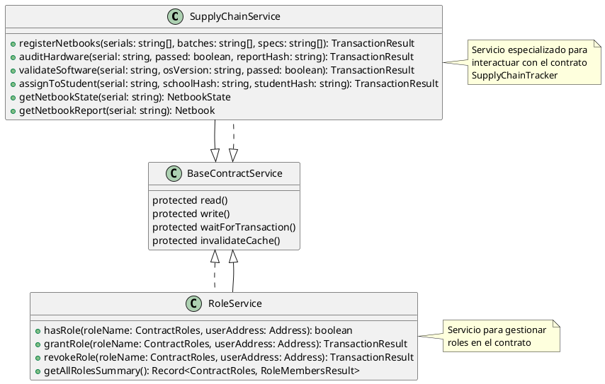
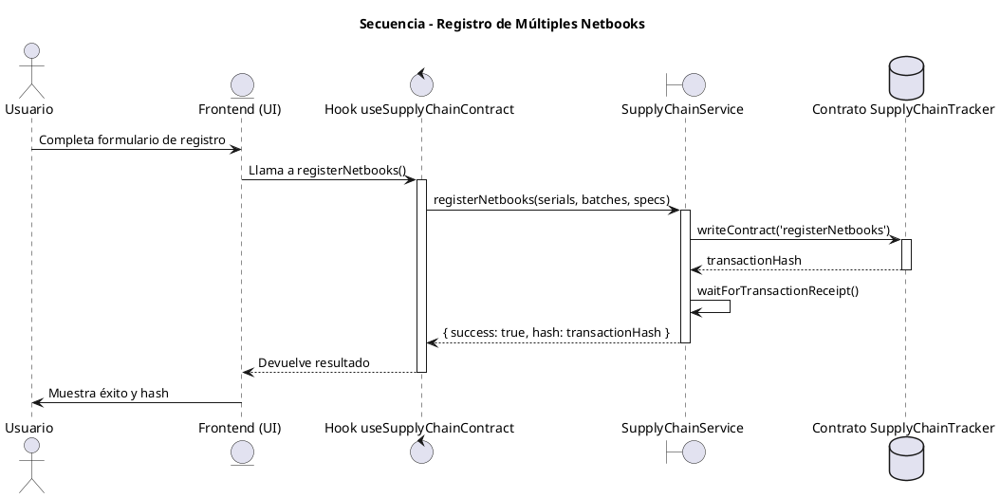
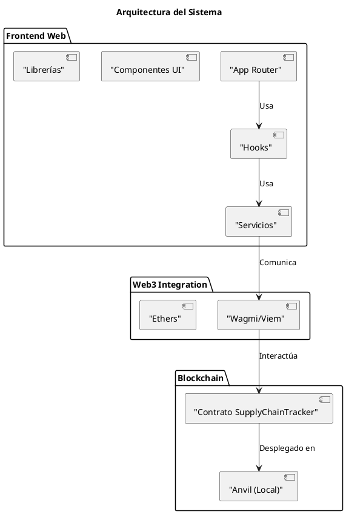

# Sistema de Trazabilidad de Netbooks - Requisitos de Documentación

## 📚 Resumen de Requisitos de Documentación

Este documento define los requisitos para una documentación completa y efectiva del sistema, cubriendo arquitectura, API, uso, y mantenimiento.

## 🎯 Objetivos de la Documentación

1. **Claridad**: Proporcionar una comprensión clara y completa del sistema
2. **Accesibilidad**: Hacer la documentación fácilmente accesible para todos los niveles de conocimiento
3. **Mantenimiento**: Facilitar la actualización y mantenimiento de la documentación
4. **Consistencia**: Mantener un estilo y formato uniformes
5. **Utilidad**: Ofrecer documentación práctica que ayude en el desarrollo y uso del sistema

## 📄 Tipos de Documentación Requerida

### 1. Documentación Técnica

#### Arquitectura del Sistema
- Diagrama de componentes
- Diagrama de secuencia de interacciones
- Diagrama de clases (para servicios y hooks)
- Flujo de datos
- Patrones de diseño utilizados

#### Configuración
- Variables de entorno y su propósito
- Configuración de Wagmi/Viem
- Configuración de Tailwind CSS
- Configuración de pruebas

#### Base de Datos (Blockchain)
- Estructura de la blockchain
- Modelos de datos
- Relaciones entre entidades
- Validaciones implementadas

### 2. Documentación de API

#### Contrato Inteligente
```solidity
// Función: registerNetbooks
// Descripción: Registra múltiples netbooks en el sistema
// Parámetros:
// - serials: Array de números de serie
// - batches: Array de IDs de lote
// - specs: Array de especificaciones del modelo
// Retorna: void
// Evento: NetbookRegistered para cada netbook registrada
```

#### Servicios de Backend
```typescript
// Método: registerNetbooks
// Ruta: POST /api/netbooks/register
// Body: { serials: string[], batches: string[], specs: string[] }
// Retorna: { success: boolean, hash?: string, error?: string }
// Autorización: Requiere rol FABRICANTE_ROLE
```

#### Hook de React
```typescript
// Hook: useSupplyChainContract
// Descripción: Hook personalizado para interactuar con el contrato SupplyChainTracker
// Métodos disponibles:
// - registerNetbooks(serials, batches, specs)
// - auditHardware(serial, passed, reportHash)
// - validateSoftware(serial, osVersion, passed)
// - assignToStudent(serial, schoolHash, studentHash)
// - getNetbookState(serial)
// - getNetbookReport(serial)
// - getAllSerialNumbers()
// Retorna: { función, estado de carga, función de manejo de errores }
```

### 3. Guías de Usuario

#### Guía de Introducción
- Cómo conectar la wallet
- Cómo navegar por el sistema
- Panel de usuario vs Panel administrativo
- Flujos principales del sistema

#### Guía Administrativa
- Cómo gestionar roles
- Cómo aprobar solicitudes
- Cómo ver reportes de actividad
- Cómo exportar datos

#### Guía de Desarrollador
- Cómo configurar el entorno de desarrollo
- Cómo ejecutar pruebas
- Cómo implementar cambios
- Convenciones de código

### 4. Documentación de Proceso

#### Flujo de Trabajo
- Diagrama del flujo de trabajo completo
- Estados validados
- Transiciones permitidas
- Roles requeridos para cada acción

#### Manual de Operaciones
- Procedimientos de respaldo
- Procedimientos de recuperación
- Monitoreo y alertas
- Mantenimiento preventivo

## 🧩 Contenido Específico Requerido

### 1. Diagramas UML

#### Diagrama de Clases


#### Diagrama de Secuencia - Registro de Netbooks


#### Diagrama de Componentes


### 2. Guía de Estilo

#### Convenciones de Nombre
- **Archivos**: kebab-case (ej: `use-supply-chain.hook.ts`)
- **Carpetas**: kebab-case (ej: `use-contracts`)
- **Variables**: camelCase (ej: `registerNetbooks`)
- **Funciones**: camelCase (ej: `getNetbookState`)
- **Componentes**: PascalCase (ej: `ActivityLogs`)
- **Tipos**: PascalCase (ej: `NetbookState`)
- **Constantes**: UPPER_CASE (ej: `DEFAULT_TTL`)

#### Formato de Código
- Indentación: 2 espacios
- Límite de línea: 100 caracteres
- Comillas simples para strings
- Punto y coma al final de cada declaración
- Espacios después de comas y alrededor de operadores

#### Estructura de Archivos
```
src/
├── app/                    # Rutas de Next.js
├── components/            # Componentes UI reutilizables
├── hooks/                 # Hooks personalizados
├── services/              # Servicios de negocio
├── lib/                   # Utilidades y configuraciones
├── types/                 # Tipos TypeScript
└── contracts/            # ABIs y tipos de contratos
```

#### Comentarios
- **TSDoc**