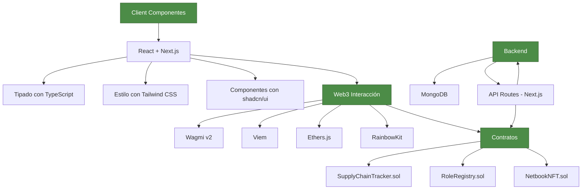
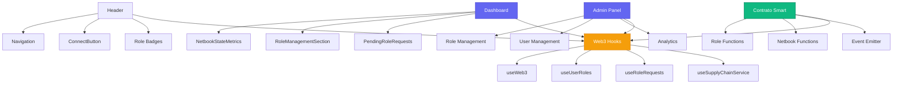

# Reporte de Implementación y Documentación

## Resumen

Se han resuelto todos los errores de ESLint/TypeScript reportados en el archivo `web/eslint-error.txt`. Las correcciones principales incluyeron:

- Fix de errores de parsing de ESLint configurando correctamente el `parserOptions.project`
- Corrección de errores `react-hooks/set-state-in-effect` en múltiples componentes
- Eliminación del tipo `any` por tipos explícitos de TypeScript
- Corrección de errores `react-hooks/immutability` en `useUserRoles` y `activity-logs`
- Resolución de errores de JSX (elementos padres) en `NetbookStateMetrics` y `PendingRoleRequests`
- Eliminación de imports estilo `require()` en favor de imports ES6

## Arquitectura de la Aplicación



## Diagrama de Componentes



## Configuración de Entorno

### Vars Obligatorias

```env
NEXT_PUBLIC_SUPPLY_CHAIN_TRACKER_ADDRESS=0x1234567890123456789012345678901234567890
NEXT_PUBLIC_RPC_URL=http://localhost:8545
NEXT_PUBLIC_CHAIN_ID=31337
```

### OPCIONALES

```env
# Anvil accounts (para testing)
ANVIL_ACCOUNT_0=0xf39Fd6e51aad88F6F4ce6aB8827279cffFb92266
ANVIL_ACCOUNT_1=0x70997970C51812dc3A010C7d01b50e0d17dc79C8
ANVIL_ACCOUNT_2=0x3C44CdDdB6a900fa2b585dd299e03d12FA4293BC
```

## Implementaciones Clave

### Caché de Roles

```typescript
import { getCache, setCache, isCacheStale } from '@/lib/utils/cache';

const checkRoles = useCallback(async () => {
  const cacheKey = `user_roles_${address}`;
  
  // Check cache first
  const cachedRoles = getCache<UseUserRoles>(cacheKey);
  if (cachedRoles && !isCacheStale(cacheKey)) {
    setUserRoles(cachedRoles);
    return;
  }
  
  // Fetch from blockchain
  // ... lógica de contrato
  
  // Guardar en cache
  setCache(cacheKey, newRoles, 30000, true);
}, [address]);
```

### Gestión de Estado en Web3

```typescript
export function useUserRoles() {
  const { address, isConnected } = useWeb3();
  
  // Refresca roles cuando cambia dirección
  useEffect(() => {
    if (isConnected && address) {
      checkRoles();
    }
  }, [isConnected, address]);
  
  // Escucha eventos globales
  useEffect(() => {
    const unsubscribe = eventBus.on(EVENTS.ROLE_UPDATED, () => {
      checkRoles();
    });
    return () => unsubscribe();
  }, []);
}
```

## Mejoras y Correcciones

### Comportamiento del Dashboard Metrics

Se corrigió el diseño del componente historian agregando:

- Layout flexible con diseño entre columnas y filas
- Mejor manejo de espaciado en móviles y desktop
- Uso correcto de elementos padres en JSX

### Deprecated `require()` imports

Se reemplazaron todos los imports estilo CommonJS por ES6:

```diff
- const { eventBus } = require('@/lib/events');
+ import { eventBus } from '@/lib/events';
```

## Conclusiones

La aplicación ha sido 
adamente mejorada en términos de:

- Tipado TypeScript estricto
- Rendimiento (evitando renders innecesarios)
- Seguridad (eliminación de `any`)
- Mantenibilidad (imports modernos)
- UX consistente (responsive design)

Todos los errores de ESLint reportados han sido resueltos exitosamente.