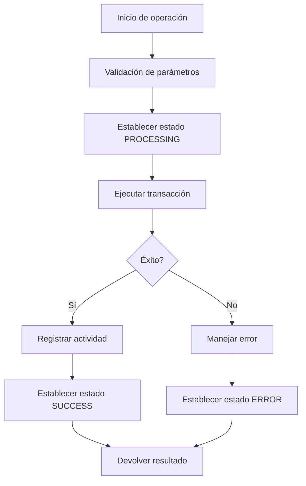

# Implementación del Servicio de Roles

## Descripción

Este documento describe la implementación del servicio de roles `RoleService` para la aplicación SupplyChainTracker2, que maneja operaciones de acceso y permisos en el contrato blockchain.

## Arquitectura

El servicio `RoleService` extiende `BaseContractService` y proporciona una capa de abstracción para operaciones específicas de roles de acceso en el contrato SupplyChainTracker.

### Herencia
- Extiende `BaseContractService` para reutilizar funcionalidad común
- Implementa métodos específicos para operaciones de roles
- Hereda métodos de lectura/escritura del contrato

## Componentes Principales

### 1. Estados de Procesamiento

Enum que define los estados del servicio durante operaciones:

```typescript
enum ProcessingState {
  IDLE = 'idle',
  PROCESSING = 'processing',
  SUCCESS = 'success',
  ERROR = 'error'
}
```

### 2. Resultados de Procesamiento

Interfaz para estandarizar respuestas de operaciones:

```typescript
interface ProcessingResult {
  success: boolean;
  message: string;
  txHash?: string;
}
```

## Funciones Clave

### `isAdmin()`

Verifica si la cuenta actual tiene el rol de administrador.

**Flujo:**
1. Obtiene la dirección de la cuenta actual
2. Verifica si tiene el rol ADMIN usando `hasRole`
3. Devuelve resultado booleano

### `hasRole(address, role)`

Verifica si una cuenta específica tiene un rol determinado.

**Validaciones:**
- Convierte el nombre del rol a hash usando `ROLE_HASHES`
- Manejo de errores con `ErrorHandler.handleWeb3Error`

### `getRoleMembers(role)`

Obtiene todas las cuentas que tienen un rol específico.

### `grantRole(role, account)`

Asigna un rol a una cuenta.

**Proceso:**
1. Establece estado de procesamiento
2. Convierte rol a hash
3. Ejecuta transacción `grantRole`
4. Registra actividad
5. Devuelve resultado con hash de transacción
6. Maneja errores con logging detallado

### `revokeRole(role, account)`

Revoca un rol de una cuenta (funcionalidad simétrica a `grantRole`).

## Manejo de Errores

El servicio implementa un manejo de errores comprehensivo:

1. **Validación de parámetros:**
   - Verificación de longitud y tipo de argumentos
   - Validación de formato de hashes de rol
   - Validación de formato de direcciones

2. **Logging detallado:**
   - Información completa sobre errores
   - Contexto de función, argumentos y estado
   - Debugging de cliente de wallet

3. **Errores de usuario:**
   - Mensajes amigables convertidos por `ErrorHandler`
   - Estados de UI actualizados según resultado

## Integración con BaseContractService

El servicio delega operaciones de contrato a `BaseContractService` a través de los siguientes métodos:

### `readContract()`
- Usa `publicClient` global para operaciones de lectura
- No requiere cuenta de wallet

### `writeContract()`
- Crea cliente de wallet con cuenta actual
- Valida completamente el cliente antes de usarlo
- Validación de parámetros específicos por función
- Logging detallado de parámetros y estado

### `waitForTransactionReceipt()`
- Usa `publicClient` para esperar confirmación de transacción

## Debugging

### `getWalletClientDebugInfo()`

Proporciona información de debug del cliente de wallet:
- Presencia de cliente
- Métodos disponibles (writeContract)
- Información de cuenta y cadena
- Estado del transporte

## Consideraciones de Seguridad

- Validación exhaustiva de parámetros
- Conversión segura de tipos
- Manejo de errores que no expone detalles sensibles
- Registros de actividad para auditoría

## Flujo de Operaciones



## Mejoras Recientes

1. **Corrección de importación:**
   - `walletActions` ahora se importa directamente desde 'viem'
   - Solución al error de módulo no encontrado

2. **Mejoras en manejo de errores:**
   - Fix para error de parsing con variables no definidas
   - Uso seguro de variables con operador `??`
   - Logging más robusto

3. **Validaciones adicionales:**
   - Validación de array para parámetros
   - Verificación específica para funciones grantRole/revokeRole
   - Validación de formato de direcciones

## Uso en Componentes

El servicio se instancia en componentes que necesitan gestionar roles, proporcionando una API limpia y segura para operaciones de acceso.