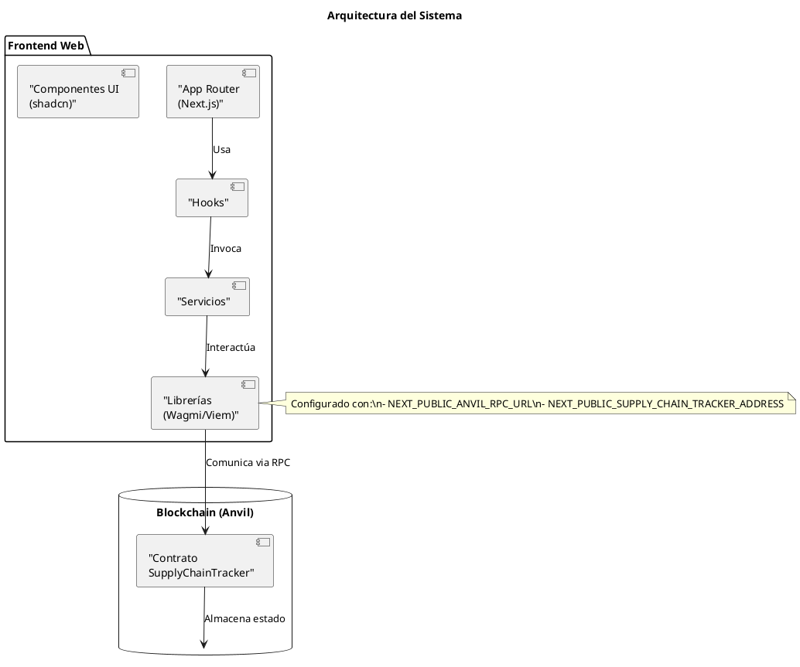
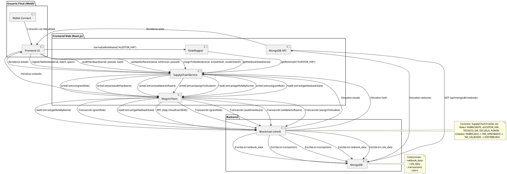
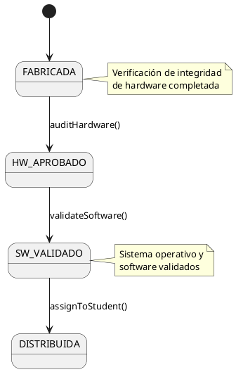

# Sistema de Trazabilidad de Netbooks - Visión General

## 🏗️ Arquitectura del Sistema

El sistema de trazabilidad de netbooks es una aplicación web3 completa que combina un contrato inteligente en Solidity con una interfaz de usuario moderna basada en Next.js. La arquitectura sigue un diseño modular con separación clara entre los componentes de blockchain y frontend.

### Estructura General
```
SupplyChainTracker2/
├── sc/                       # Contratos inteligentes (Foundry)
│   ├── src/                  # Código Solidity
│   │   └── SupplyChainTracker.sol
│   ├── lib/                  # Dependencias (OpenZeppelin)
│   └── foundry.toml          # Configuración de Foundry
├── web/                      # Aplicación frontend (Next.js)
│   ├── src/
│   │   ├── app/              # Páginas (App Router)
│   │   ├── components/       # Componentes UI
│   │   ├── contexts/         # Contextos de React
│   │   ├── contracts/        # ABIs de contratos
│   │   ├── hooks/            # Hooks personalizados
│   │   ├── lib/              # Utilidades y configuración
│   │   ├── services/         # Servicios de negocio
│   │   └── types/            # Tipos TypeScript
│   ├── .env.local          # Variables de entorno
│   └── package.json
└── docs/                   # Documentación del proyecto
```

## 🔗 Integración Blockchain-Frontend

El sistema utiliza una pila tecnológica moderna para la interacción entre la interfaz y la blockchain:

- **Wagmi**: Abstracción de bajo nivel para interacción con Ethereum
- **RainbowKit**: Componentes UI para conexión de wallets
- **Viem**: Cliente TypeScript para Ethereum con tipado estricto
- **Ethers**: Biblioteca para operaciones criptográficas

Diagrama de arquitectura:


---

## 🔄 Flujo de Datos End-to-End

El sistema opera con un flujo de datos coherente entre frontend, blockchain y base de datos, gestionado mediante hooks, servicios y API REST:


```

## 📦 Contrato Inteligente Principal

### SupplyChainTracker.sol

Contrato que implementa el seguimiento del ciclo de vida de netbooks educativas con control de acceso basado en roles.

**Herencia**:
- `AccessControlEnumerable` (OpenZeppelin)

**Roles**:
- `FABRICANTE_ROLE`: Registro de dispositivos
- `AUDITOR_HW_ROLE`: Aprobación de hardware
- `TECNICO_SW_ROLE`: Validación de software
- `ESCUELA_ROLE`: Asignación a estudiantes
- `DEFAULT_ADMIN_ROLE`: Gestión de roles

**Estados de Netbook**:
1. `FABRICADA`
2. `HW_APROBADO` 
3. `SW_VALIDADO`
4. `DISTRIBUIDA`

**Flujo de Estado**:


## 💻 Frontend - Estructura de Componentes

### Estructura de Directorios
```
src/
├── app/
│   ├── page.tsx            # Página principal
│   └── admin/
│       ├── page.tsx        # Panel administrativo
│       └── roles/
│           └── page.tsx    # Gestión de roles
├── components/
│   ├── ui/                 # Componentes shadcn
│   │   ├── button.tsx
│   │   ├── card.tsx
│   │   └── ...
│   └── layout/
│       └── Header.tsx      # Navegación principal
├── contexts/
│   └── Web3Context.tsx     # Estado de conexión Web3
├── contracts/
│   └── abi/
│       └── SupplyChainTracker.json
├── hooks/
│   └── useUserRoles.ts     # Verificación de roles
├── lib/
│   ├── wagmi/
│   │   └── config.ts       # Configuración Wagmi
│   └── env.ts              # Variables de entorno
├── services/
│   └── SupplyChainService.ts # Servicio principal
└── types/
    └── supply-chain-types.ts
```

## 🔐 Control de Acceso y Roles

El sistema implementa un mecanismo robusto de control de acceso basado en roles (RBAC) tanto en la blockchain como en el frontend.

### Mapeo de Roles

| Rol | Dirección/Búsqueda | Contrato | Frontend |
|------|-------------------|----------|----------|
| Administrador | `DEFAULT_ADMIN_ROLE` | `hasRole()` | `useUserRoles` |
| Fabricante | `FABRICANTE_ROLE` | `hasRole()` | `useUserRoles` |
| Auditor HW | `AUDITOR_HW_ROLE` | `hasRole()` | `useUserRoles` |
| Técnico SW | `TECNICO_SW_ROLE` | `hasRole()` | `useUserRoles` |
| Escuela | `ESCUELA_ROLE` | `hasRole()` | `useUserRoles` |

### Hook useUserRoles

Hook personalizado que determina los permisos del usuario actual basado en la conexión a wallet:

```typescript
export const useUserRoles = (): UseUserRoles => {
  const { address, isConnected } = useWeb3();
  
  // Obtiene hashes de roles del contrato
  const rolePromises = [
    readContract(config, {
      address: contractAddress,
      abi: SupplyChainTrackerABI,
      functionName: 'FABRICANTE_ROLE'
    }),
    // ... otros roles
  ];
  
  // Verifica roles del usuario actual
  const [isAdmin, isManufacturer, /* ... */] = await Promise.all([
    SupplyChainService.hasRole('0x000...000', address),
    SupplyChainService.hasRole(fabricanteRoleStr, address),
    // ... otros roles
  ]);
  
  return {
    isAdmin,
    isManufacturer,
    isHardwareAuditor,
    isSoftwareTechnician,
    isSchool,
    isLoading,
    hasRole,
    activeRoleNames
  };
};
```

## ⚙️ Configuración y Variables de Entorno

### Archivo .env.local

```env
# RPC URL for Anvil connection
NEXT_PUBLIC_ANVIL_RPC_URL=http://127.0.0.1:8545

# Deployed contract address
NEXT_PUBLIC_SUPPLY_CHAIN_TRACKER_ADDRESS=0x5FbDB2315678afecb367f032d93F642f64180aa3

# WalletConnect Project ID
NEXT_PUBLIC_WALLETCONNECT_PROJECT_ID=3f2061443d834950482da0873d6e32d6

# Default admin address
NEXT_PUBLIC_DEFAULT_ADMIN_ADDRESS=0xf39Fd6e51aad88F6F4ce6aB8827279cffFb92266

#