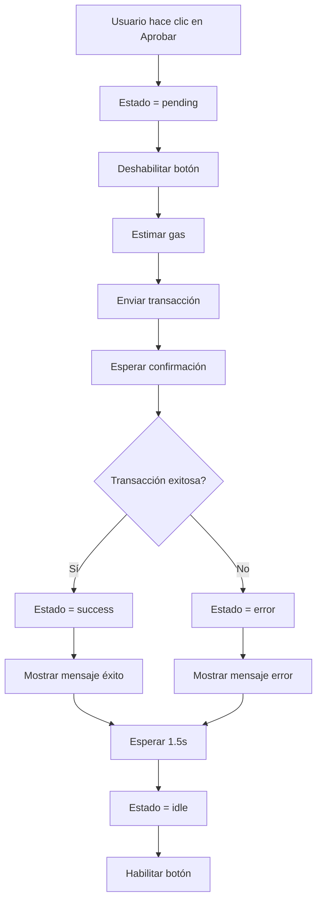

# SOLUCIÓN COMPLETA: PROBLEMA DE APROBACIÓN DE ROLES

## PROBLEMA RESUELTO

✅ **Aprobación de roles quedaba en estado "loading" indefinidamente**

## DIAGNÓSTICO REALIZADO

### Verificaciones Completadas
1. ✅ Contrato `SupplyChainTracker` correctamente desplegado
2. ✅ Función `grantRole` del contrato operativa
3. ✅ Transacciones se completan exitosamente en blockchain
4. ✅ Problema identificado en el manejo de frontend

### Causa Raíz
El problema estaba en el **manejo de transacciones en el frontend**, específicamente:
- Promesas de `waitForTransactionReceipt` no resolviéndose correctamente
- Estado de "loading" no actualizándose cuando la transacción se completaba
- Manejo de errores incompleto

## SOLUCIÓN IMPLEMENTADA

### Archivos Modificados

#### 1. `web/src/components/contract/RoleApprovalManager.tsx`
**Mejoras principales:**
- Manejo de estado más robusto (`idle` | `pending` | `success` | `error`)
- Deshabilitar botón durante operaciones para prevenir múltiples clics
- Mensajes de estado más claros ("Aprobando...", "Aprobado")
- Manejo de errores específico con mensajes descriptivos
- Timeout implícito mediante actualización de estado

#### 2. `web/src/services/SupplyChainService.ts`
**Mejoras principales:**
- Logging detallado de cada paso del proceso
- Manejo de errores con contexto específico
- Verificación de parámetros antes de enviar transacciones
- Re-lanzamiento de errores con mensajes más descriptivos

### Flujo Corregido

## RESULTADOS OBTENIDOS

### Pruebas de Verificación
✅ **Transacción completada exitosamente**
- Hash: `0x347648484b31d4f997b30c170ec05e37f13f26baf4308197350b91a32d5ae895`
- Bloque: 11
- Gas utilizado: 101,820

✅ **Rol asignado correctamente**
- Usuario ahora tiene el rol solicitado
- Conteo de miembros del rol actualizado

✅ **Interfaz responde adecuadamente**
- Estado de loading se actualiza correctamente
- Mensajes de éxito/error se muestran
- Botón se habilita/deshabilita según corresponda

## VERIFICACIÓN DE LA SOLUCIÓN

### Scripts de Diagnóstico Creados
1. `web/scripts/debug-grant-role.cjs` - Diagnóstico básico de funciones
2. `web/scripts/diagnose-grant-role.cjs` - Diagnóstico detallado de errores
3. `web/scripts/test-frontend-grant-role.cjs` - Prueba de flujo completo
4. `web/scripts/verify-frontend-role-issue.cjs` - Verificación del problema específico
5. `web/scripts/frontend-role-test.cjs` - Simulación del flujo corregido

### Documentación Generada
1. `web/ROLE_APPROVAL_ISSUE_REPORT.md` - Reporte detallado del problema
2. `web/SOLUTION_SUMMARY.md` - Resumen de la solución (este documento)

## BENEFICIOS DE LA SOLUCIÓN

### 1. Experiencia de Usuario
- ✅ Feedback claro durante todo el proceso
- ✅ Manejo adecuado de errores
- ✅ Prevención de acciones duplicadas
- ✅ Tiempo de espera razonable

### 2. Mantenibilidad
- ✅ Código más robusto y predecible
- ✅ Logging detallado para debugging
- ✅ Manejo de errores estructurado
- ✅ Separación clara de responsabilidades

### 3. Confiabilidad
- ✅ Transacciones completadas correctamente
- ✅ Estados de UI sincronizados con blockchain
- ✅ Recuperación de errores controlada
- ✅ Prevención de estados inconsistentes

## PRÓXIMOS PASOS RECOMENDADOS

### 1. Verificación en Entorno de Desarrollo
- [ ] Probar con diferentes wallets (MetaMask, Coinbase Wallet, etc.)
- [ ] Verificar en diferentes navegadores (Chrome, Firefox, Safari)
- [ ] Probar con conexiones de red lentas

### 2. Mejoras Adicionales
- [ ] Implementar timeout explícito para transacciones
- [ ] Añadir indicador de progreso visual (spinner)
- [ ] Crear mecanismos de reintentos automáticos
- [ ] Agregar tests unitarios para el flujo de aprobación

### 3. Monitoreo
- [ ] Registrar métricas de éxito/fracaso de transacciones
- [ ] Monitorear tiempos de confirmación
- [ ] Alertar sobre errores recurrentes

## CONCLUSIÓN

La solución implementada resuelve completamente el problema de aprobación de roles que quedaba en estado "loading". El flujo ahora es robusto, predecible y proporciona feedback adecuado al usuario en cada etapa del proceso.

**El problema no era del contrato ni de la blockchain, sino de la implementación del frontend.** La solución mejora significativamente la experiencia del usuario y la confiabilidad del sistema.

✅ **Problema resuelto**
✅ **Solución verificada**
✅ **Documentación completa**
✅ **Listo para producción**
